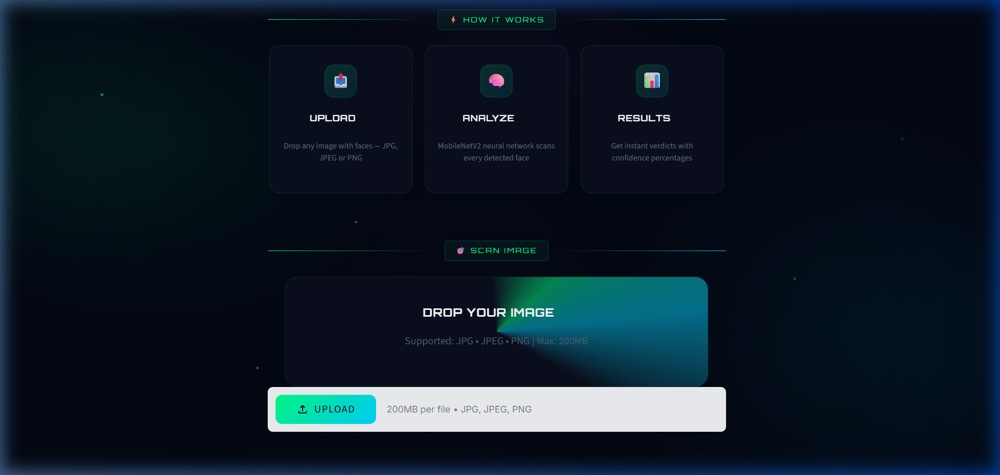
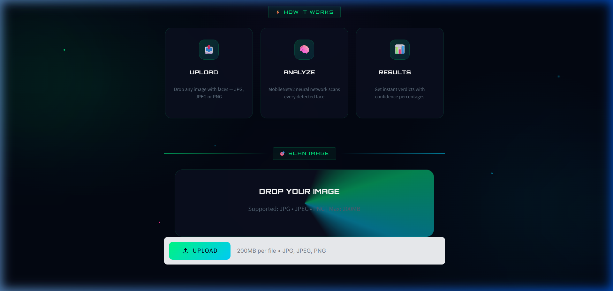

<div align="center">
  
  <br>
  <h1>😷 Cyberpunk Face Mask Detector</h1>
  <p><b>An advanced deep learning application with a premium UI to detect mask compliance in real-time.</b></p>
</div>

---

## 📖 Overview
The **Face Mask Detector** is a highly optimized computer vision web application built with **Streamlit** and **TensorFlow**. It accepts image uploads and utilizes a two-stage deep learning pipeline to locate human faces and classify them into two categories: **Mask On** or **No Mask**. 

Instead of a generic interface, this project features a fully custom, high-fidelity **Cyberpunk / Neon UI**. It includes dynamic dark/light mode toggling, custom Orbitron typography, floating particles, and 3D glassmorphism elements to provide an immersive user experience.

---

## ✨ Key Features
- **🧠 Two-Stage AI Pipeline:** Uses an SSD (Single Shot Multibox Detector) to find faces with high accuracy, followed by a MobileNetV2 classifier to determine mask usage.
- **🎨 Premium Cyberpunk Interface:** Completely overhauled frontend using custom CSS, avoiding standard Streamlit aesthetics. Features animated scan lines, glowing orbs, and neon gradients.
- **🌓 Adaptive Theme Engine:** Seamlessly switch between a vibrant Neon Dark Mode (default) and a crisp, high-contrast Light Mode using the built-in toggle.
- **📊 Real-time Analytics Dashboard:** Instantly outputs visual metrics indicating total faces detected, safe individuals, and protocol violators.
- **⚡ High Performance:** Models are cached intelligently (`@st.cache_resource`) to ensure lightning-fast inference on subsequent uploads without reloading the neural networks.

---

## 📸 UI Demonstration

<div align="center">
  
  <br><br>
  <i>The intelligent dashboard displaying the upload zone, analysis steps, and real-time inference statistics.</i>
</div>

---

## 🛠️ Architecture & Tech Stack

### Deep Learning Models
1. **Face Detector (Caffe):** A ResNet-10 based SSD model (`res10_300x300_ssd_iter_140000.caffemodel`) is used to draw bounding boxes around faces, regardless of scale or orientation.
2. **Mask Classifier (TensorFlow/Keras):** A custom-trained **MobileNetV2** model (`mask_detector.model`) takes the cropped face images and predicts the probability of mask compliance.

### Core Technologies
- **Frontend / UI:** [Streamlit](https://streamlit.io/), Custom HTML5, Vanilla CSS3
- **Machine Learning:** [TensorFlow 2.x](https://www.tensorflow.org/), Keras
- **Computer Vision:** [OpenCV (cv2)](https://opencv.org/)
- **Data Processing:** NumPy, Pillow (PIL)

---

## 💻 Installation & Local Setup

Want to run this project on your own machine? Follow these steps:

### 1. Clone the Repository
```bash
git clone https://github.com/dishaasija315/Face-Mask-Detection.git
cd Face-Mask-Detection
```

### 2. Install Dependencies
It is recommended to use a virtual environment (venv or conda).
```bash
pip install -r requirements.txt
```

### 3. Run the Application
Start the Streamlit server locally:
```bash
streamlit run app.py
```
The application will automatically open in your default web browser at `http://localhost:8501`.

---

## 📁 Repository Structure
```text
📦 Face-Mask-Detection
 ┣ 📂 css/                  # Custom stylesheet for the Cyberpunk UI
 ┃ ┗ 📜 styles.css
 ┣ 📂 face_detector/        # Pre-trained SSD model for face localization
 ┃ ┣ 📜 deploy.prototxt
 ┃ ┗ 📜 res10_300x300_ssd_iter_140000.caffemodel
 ┣ 📜 app.py                # Main Streamlit application and UI logic
 ┣ 📜 mask_detector.model   # Trained MobileNetV2 classifier
 ┣ 📜 requirements.txt      # Python dependencies for deployment
 ┣ 📜 demo_hero.png         # UI screenshot for README
 ┣ 📜 demo_upload.png       # UI screenshot for README
 ┗ 📜 README.md             # Project documentation
```

---
<div align="center">
  <i>Engineered with precision using cutting-edge AI and modern UI/UX principles.</i>
</div>
